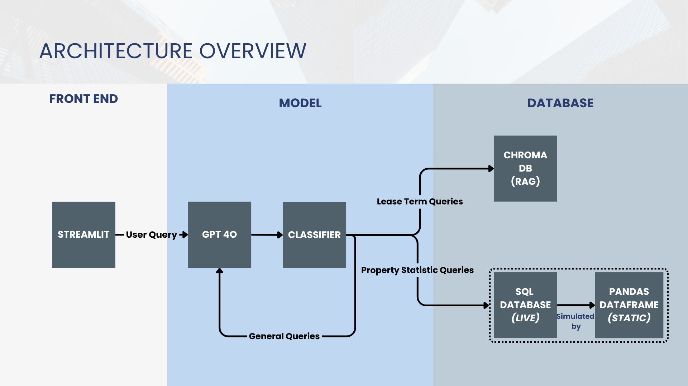
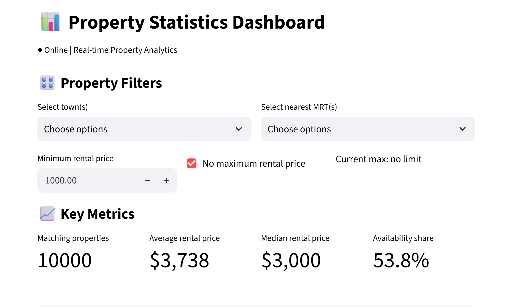

# Property Agent Chatbot

## Description

This repository contains the architecture and deployment of a real-estate chatbot which handles user queries and serves as an aid to property agents. User queries are classified into one of three categories: lease term queries, property statistical queries, or general queries. The queries are then processed by the chatbot. The architecture overview is shown in the following diagram:





Other than the main chatbot page, the deployed website also contains a property statistics page, which provides users with clear visualizations of the property database stored in the model. User can interactively filter the properties by different features and view their statistics. 




## Repository

* **model_v2.py** - main GenAI model to implement the chatbot.
* **streamlit_trial.py** - streamlit deployment of the main model. Please refer to below section for how to launch the webpage.
* **property_data_generator** - folder containing codes and datasets to generate the csv database used by the chatbot for property statistics analysis. The final database used is *property_database_v4.csv*. The folder also contains example tenancy clauses, compiled and stored in *ALL TENANCY CLAUSES.pdf*, covering common tenancy agreement terms as well as property specific rules (HDB/Condo/Apartment/Landed).
* **question_answer_pair** - folder containing question answer pairs used for evaluation and testing of the model. For each question, a difficulty level (easy/moderate/complex) is assigned, and a sample answer is compared against actual model outputs.
* **superseded_files** - folder containing old files used to build the model. These files are now obsolete and are replaced by newer versions.


## Getting Started

### Setup and Installation

1. Clone the repository:
   ```bash
   git clone https://github.com/yongseng87/gen-ai-property-chatbot.git
   ```

2. Navigate to the repository folder:
   ```bash
   cd gen-ai-property-chatbot
   ```

3. Install the required dependencies:
   ```bash
   pip install -r requirements.txt
   ```

### Launch Webpage

```python
streamlit run streamlit_trial.py
```

## Credit

* Lim Kai Xiang - kai.xiang@u.nus.edu
* Quek Yong Seng - e1591852@u.nus.edu
* Wen Qianyi (Vivian) - qianyi.wen@u.nus.edu
* Zhang Jiasheng - e1597508@u.nus.edu